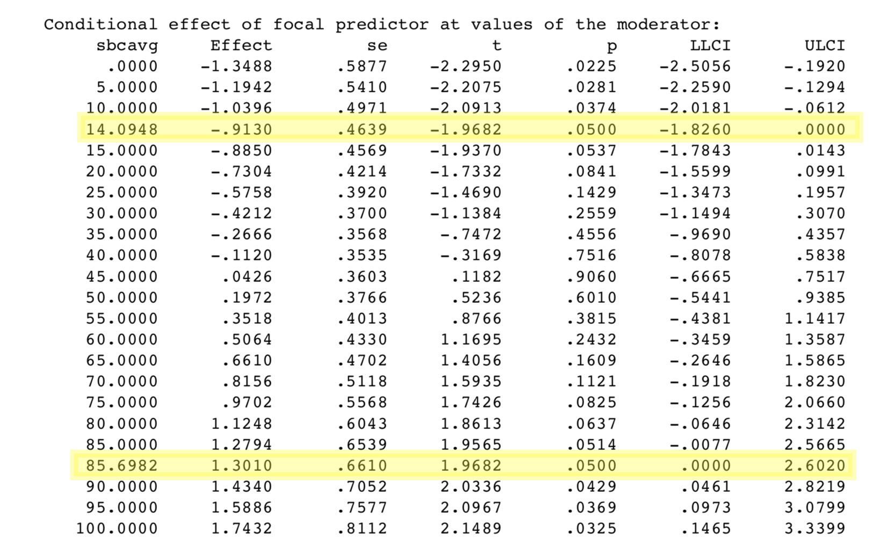

```{r setup, include = FALSE}
knitr::opts_chunk$set(echo = TRUE, warning = FALSE, message = FALSE, fig.align = "center", fig.width = 10, fig.height = 7)

library(rio)
library(tidyverse)
library(dplyr)
library(janitor)
library(ggplot2)
theme_set(theme_minimal())
library(knitr)
library(kableExtra)
library(ggthemes)
library(colorblindr)
```

For my EDLD 610 final portfolio, I will be working with primary data from my current research on the impact of brand activism on subsequent consumer action. 

## The Project

The project investigates the degree to which statements released from brands in support of divisive socio-political issues elicit pro-issue consumer response. Our guiding theoretical framework posits that self-brand connection (SBC), or the degree of identity-based overlap between self and brand, is a key determinant that shapes the hypothesized positive relationship between brand activism and subsequent consumer response. More specifically, high- (vs. low-) SBC consumers should view the brand’s activism as an exemplar for their own.

Drawing on balance theory, an established conceptualization of attitude formation and modeling, we suggest that individuals seek self-coherence by achieving attitudinal balance with those to whom they feel connected. Notably, if the consumer feels connected to the brand, and the brand asserts a connection to a given activist cause, then the consumer should follow by aligning themselves with that same cause, i.e., to maintain self-coherence.

## The Data

The visualizations you are about to see come from one particular study in this line of research. In this study, we examined donation behavior in connection to an external source of activism. This was meant to ensure that demand characteristics of the study design did not explain the focal effect. An opportunity for such a design presented itself on September 4, 2018, when the athletic apparel brand Nike selected as their spokesperson football player Colin Kaepernick, who is famous for his civil rights demonstrations at NFL games (Draper and Belson 2018). 

Nike’s choice of Kaepernick was activist in nature; it signaled Nike’s support for civil rights and those who advocate for them. We reasoned that only some consumers would be aware of this breaking news and therefore tested whether knowledge of Nike’s activism increased high (vs. low) SBC consumers’ donations to a civil rights group (Black Lives Matter). We recorded donations first, such that no other study-related details could influence the focal effects. There is no identifiable information in my data sources. 

**Note:** I ran this study on the same day as Nike first unveiled their 30th anniversary campaign. This was done to capitalize on a natural and ecologically valid instance of brand activism in popular culture, as well as draw comparisons between those who were and were not aware of it. If I waited too long, there would not be a baseline "no awareness" group from which to draw comparisons.

## Data Import

We'll begin by importing the data. There are a few continuous variables we'll have to calculate. First, because SBC is derived from a seven-item scale, we'll add each subject's values for these items and average them. We'll do the same for their self-reported attitude toward the focal cause (i.e., Black Lives Matter). 

```{r import}
d <- import("./d.csv", setclass = "tibble") %>% 
  clean_names() %>% 
  mutate(sbcavg = (sbc_4 + sbc_5 + sbc_6 + sbc_7 + sbc_8 + sbc_9 + sbc_10)/7, 
         att_cause = (att_cause_1 + att_cause_2 + att_cause_3)/3) %>% 
  filter(sbcavg != "NA") %>% 
  mutate(know2 = as.factor(know2),
         know2 = recode(know2, "1" = "Yes", "0" = "No"))
```

## Main Effect of SBC on Donations

Time to finally put our data visualization skills to the test. First, I would like to see that the hypothesized main effect of self-brand connection (SBC) on donations came through. This should demonstrate that that the more connected an individual consumer feels to an activist brand, the more they will want to donate to a related activist cause (i.e., Black Lives Matter).

### Version 1

I started by plotting the regression line via `geom_smooth`. 

**Note**: I don't show the many versions of my plot titles and labels here, since that would take a *long*, long while. However, it is worth noting that I went through many trial-and-error iterations to find the right length, size, page orientation, and styling for them. I ultimately settled on a consistent look, which is included in the `theme` argument for all plots in this document.

```{r main_effect_1}
ggplot(d, aes(x = sbcavg, y = donate_3)) +
  geom_smooth(se = FALSE) +
  scale_y_continuous(labels = scales::dollar) +
  labs(x = "\nSelf-Brand Connection (SBC)\n", 
       y = "Donations\n", 
       title = "\nSBC to Nike increased donations", 
       subtitle = "A 10-point increase in SBC is associated with a $0.33 boost in donation amount\n") +
  theme(plot.title = element_text(size = 30, face = "bold", hjust = 0.5), 
        plot.subtitle = element_text(size = 15, hjust = 0.5),
        legend.title = element_text(size = 20, face = "bold"),
        axis.text = element_text(size = 15),
        axis.title = element_text(size = 18, face = "bold"))
```

### Version 2

While the above plot communicates some information, it doesn't include uncertainty. As such, I removed `se = FALSE` from my code, i.e., in order to visualize the standard error of my estimate. Also, for the sake of clarity and parsimony, my theory assumes a positive *linear* relationship between SBC and donations. As such, I added a `method = "lm"` argument to my `geom_smooth` to show the linear trend. 

Finally, on top of the regression line, I  plotted the raw data. Since participants were given only a range of $0-10 to donate to Black Lives Matter, you will notice some binning in the data — there is data clumping at certain dollar intervals.

```{r main_effect_2}
ggplot(d, aes(x = sbcavg, y = donate_3)) +
  geom_smooth(method = "lm") +
  geom_jitter(alpha = .6) +
  scale_y_continuous(labels = scales::dollar) +
  labs(x = "\nSelf-Brand Connection (SBC)\n", 
       y = "Donations\n", 
       title = "\nSBC to Nike increased donations", 
       subtitle = "A 10-point increase in SBC is associated with a $0.33 boost in donation amount\n") +
  theme(plot.title = element_text(size = 30, face = "bold", hjust = 0.5), 
        plot.subtitle = element_text(size = 15, hjust = 0.5),
        legend.title = element_text(size = 20, face = "bold"),
        axis.text = element_text(size = 15),
        axis.title = element_text(size = 18, face = "bold"))
```

I could see this visualization being understood by a **general audience**, although the individual data points may take away from the communicative effectiveness of the overall trend line.

## SBC by Activism Awareness Interaction on Donations

Now for the real deal. My guiding theoretical framework suggests that consumers will align their activism with that of a connected *when* that brand demonstrates activism behavior. As such, it is integral to see how consumers decided to donate when they did versus did not know of Nike's 30th anniversary campaign with Colin Kaepernick. Running this study on launch day of the campaign allowed for me to draw comparisons between these two groups before the campaign was covered on the evening news. 

## Knowledge of Nike's Activism

I wanted to see how many participants knew vs. did not know of Nike's activism. In the study, I asked participants to write about any recent news they heard about Nike lately. I coded knowledge as "1" when participants either mentioned Colin Kaepernick by name or said something about the controversy surrounding Nike's new spokesperson. Participants were coded as "0" otherwise.

Here is the table of results.

```{r table}
table <- group_by(d, know2) %>%
  summarize(count = n())

kable(table, col.names = c("Awareness", "n"), align = 'c') %>% 
  kable_styling(bootstrap_options = c("striped", "hover"), 
                full_width = T) %>% 
  column_spec(1, width = "10em", bold = T, border_right = T) %>% 
  column_spec(2, background = "yellow")
```

A roughly equal number of participants knew vs. did not know about Nike's activism. Awesome!

Now, let's see whether knowledge of activism interacts with SBC.

## Johnson-Neyman Plot

This next visualization took a bit of work to figure out. I'd like to see if awareness of Nike's Kaepernick campaign interacted with SBC to affect donations to Black Lives Matter. Given my theorizing, high-SBC consumers should increase their donations most when they know of Nike's activism. Consumers achieve self-coherence when they align their behavior with that of an self-relevant associative in-group. Can brand activism influence consumer activism?

### Version 1

I started with two trend lines to visualize the effect of SBC on donations at both levels of activism awareness (i.e., yes vs. no). I again applied `method = lm` to account for the linear trend in my theoretical model. 

```{r interaction_1}
d$know2 <- factor(d$know2, levels = c("Yes", "No"))

model <- lm(donate_3 ~ sbcavg * know2, data = d)
summary(model)

ggplot(d, aes(x = sbcavg, y = donate_3, color = know2)) +
  geom_smooth(method = "lm") +
  scale_y_continuous(labels = scales::dollar) +
  labs(x = "\nSelf-Brand Connection (SBC)\n", 
       y = "Donations\n", 
       title = "\nActivism awareness by SBC interaction", 
       subtitle = "Stronger relationship between SBC and activism for those aware of activism\n", 
       color = "Awareness") +
  theme(plot.title = element_text(size = 30, face = "bold", hjust = 0.5), 
        plot.subtitle = element_text(size = 15, hjust = 0.5),
        legend.title = element_text(size = 20, face = "bold"),
        legend.text = element_text(size = 15),
        axis.text = element_text(size = 15),
        axis.title = element_text(size = 18, face = "bold"))
```

### Version 2

Still, there is more I can do! 

I have a continuous predictor (SBC) and a categorical predictor (activism awareness). As such, I can use floodlight analysis to communicate at what specific threshold values of SBC there emerges a significant difference between being aware vs. unaware of Nike's activism. I performed this floodlight analysis using the HAYES macro in SPSS. You can see the results in a screenshot below.

<p style="text-align:center;"></p>

As can be seen from the output above, the threshold points are at 14.09 and 85.70. That means all simple effects at SBC < 14.09 are significant, and all simple effects at SBC > 85.70 are significant. I therefore applied `geom_vline` at those specific values of SBC. Those will be my *x*-intercepts.

```{r interaction_2}
d$know2 <- factor(d$know2, levels = c("Yes", "No"))

ggplot(d, aes(x = sbcavg, y = donate_3, color = know2)) +
  geom_smooth(method = "lm") +
  scale_y_continuous(labels = scales::dollar) +
  labs(x = "\nSelf-Brand Connection (SBC)\n", 
       y = "Donations\n", 
       title = "\nActivism awareness by SBC interaction", 
       subtitle = "Stronger relationship between SBC and activism for those aware of activism\n", 
       color = "Awareness") +
  geom_vline(xintercept = c(14.09, 85.70), color = "black", linetype = 2) +
  theme(plot.title = element_text(size = 30, face = "bold", hjust = 0.5), 
        plot.subtitle = element_text(size = 15, hjust = 0.5),
        legend.title = element_text(size = 20, face = "bold"),
        legend.text = element_text(size = 15),
        axis.text = element_text(size = 15),
        axis.title = element_text(size = 18, face = "bold"))
```

### Visualization 3

Still, what is being communicated with these vertical lines is not clear. As such, I'll need to add a couple annotations to the plot to explain their relevance. Additionally, the plot above was *not* colorblind-friendly. We can change that by adding the `OkabeIto` color palette to our trend lines for participants at both levels of activism awareness.

```{r interaction_3}
ggplot(d, aes(x = sbcavg, y = donate_3, color = know2)) +
  geom_smooth(method = "lm") +
  scale_y_continuous(labels = scales::dollar) +
  labs(x = "\nSelf-Brand Connection (SBC)\n", 
       y = "Donations\n", 
       title = "\nActivism awareness by SBC interaction", 
       subtitle = "Stronger relationship between SBC and activism for those aware of activism\n", 
       color = "Awareness") +
  scale_color_OkabeIto() +
  geom_vline(xintercept = c(14.09, 85.70), color = "black", linetype = 2) +
  annotate("label", label = "Region of significance\nat SBC < 14.09", x = 14.09, y = 4.5, color = "black", size = 4.5) +
  annotate("label", label = "Region of significance\nat SBC > 85.70", x = 85.70, y = 6.3, color = "black", size = 4.5) +
  theme(plot.title = element_text(size = 30, face = "bold", hjust = 0.5), 
        plot.subtitle = element_text(size = 15, hjust = 0.5),
        legend.title = element_text(size = 20, face = "bold"),
        legend.text = element_text(size = 15),
        axis.text = element_text(size = 15),
        axis.title = element_text(size = 18, face = "bold"))
```

SBC positively affects donation intentions for those with and without knowledge of Nike's activism. However, knowledge moderates the strength of SBC's effect on donation intentions.

Donation intentions for Black Lives Matter were *highest* when participants had a strong connection to Nike and were aware of its activism. The caveat is that donation intentions for Black Lives Matter were *lowest* when participants had a weak connection to Nike and knew of its activism. This provides some evidence that consumers use their association with or disassociation from a focal brand to decide how to engage with a particular activist cause.

This plot is intended more for a **specialized audience**, particularly those with expert knowledge of moderation and the idea behind floodlight analysis.

But now another question emerges: What happens when we throw political orientation into the mix?

## Political Orientation?

We can imagine that political orientation would matter a great deal when it comes to the amount of money consumers wish to give to activist cause Because such causes slant politically left or right, it would make sense that those whose political orientation aligns (conflicts) with the cause would want to donate more (less) to it. Let's delve into the results to see what happened here!

To begin, we'll clean the data a bit. The following code chunk accomplishes two main tasks:

1) Remove all participants who indicated their political orientation as "Other."
2) Create a summary dataframe with mean, standard deviation, and standard error information for self-identified conservatives, liberals, and moderates at the two values of SBC (i.e., high vs. low), as well as the two values of activism awareness (yes vs. no).

```{r pol}
d <- d %>% 
  mutate(polit = recode(polit, "1" = "Conservative", "2" = "Moderate", "3" = "Liberal", "4" = "Other")) %>% 
  filter(polit != "Other") %>% 
  mutate(sbc_cat = ifelse(sbcavg >= median(sbcavg), "High", "Low"))

pol <- d %>% 
  group_by(polit, sbc_cat, know2) %>% 
  filter(polit != "Other" & polit != "NA") %>% 
  summarize(n = n(),
            mean = mean(donate_3),
            sd = sd(donate_3),
            se = plotrix::std.error(donate_3))
```

## Identifying the Distribution of Donation Amount for Each Political Orientation

### Visualization 1

While perhaps not the most illustrative visualization of the data, the follow density plot depicts the overall distribution of donations to Black Lives Matter by three political orientations: conservative, liberal, and moderate. 

```{r distributions_1}
ggplot(d, aes(x = donate_3, fill = polit)) +
  geom_density(alpha = .4) +
  scale_x_continuous(labels = scales::dollar) +
  facet_wrap(~polit, ncol = 1) +
  labs(x = "\nDonations to BLM\n", 
       y = "Density\n", 
       fill = "Political Orientation", 
       title = "\nDonations to BLM by political orientation\n") +
  theme(plot.title = element_text(size = 30, face = "bold", hjust = 0.5), 
        plot.subtitle = element_text(size = 15, hjust = 0.5),
        legend.position = "none",
        legend.text = element_text(size = 15),
        axis.text = element_text(size = 15),
        strip.text = element_text(size = 15),
        axis.title = element_text(size = 18, face = "bold"))
```

This is interesting enough, but some more information can be added to make drawing comparisons between the three political orientations a bit more intuitive. After all, density distributions are difficult to interpret, so additional visual cues will be helpful.

I would like to add lines to indicate the average donation amount for each political orientation. To do this, I will calculate means for each group and apply `geom_vline` to each distribution, with the *x*-intercept set as equal to the mean donation amount.

Next, to make political orientation as salient as possible, I will re-color each density distribution to align with the party represented (i.e., red for conservative, blue for liberal, and green for moderate).

```{r distributions_2}
sum <- pol %>% 
  group_by(polit) %>% 
  filter(polit != "Other" & polit != "NA") %>% 
  summarize(mean = mean(mean))

ggplot(d, aes(x = donate_3, fill = polit)) +
  geom_density(alpha = .4) +
  scale_fill_manual(values = c("red", "cornflower blue", "forest green")) +
  geom_vline(data = sum, aes(xintercept = mean), linetype = "dashed") +
  scale_x_continuous(labels = scales::dollar) +
  facet_wrap(~polit, ncol = 1) +
  labs(x = "\nDonations to BLM\n", 
       y = "Density\n", 
       fill = "Political Orientation", 
       title = "\nDonations to BLM by political orientation\n", 
       caption = "Dashed lines indicate mean donation") +
  theme(plot.title = element_text(size = 30, face = "bold", hjust = 0.5), 
        plot.subtitle = element_text(size = 15, hjust = 0.5),
        legend.title = element_text(size = 20, face = "bold"),
        legend.position = "none",
        legend.text = element_text(size = 15),
        axis.text = element_text(size = 15),
        strip.text = element_text(size = 15),
        axis.title = element_text(size = 18, face = "bold"))
```

It is interesting to see that there is more of a right skew to the distribution for conservatives and moderates than for liberals. This makes sense, as the cause, Black Lives Matter, aligns more with left-leaning political motives than right-leaning. But there might be more than meets the eye going on with the data here. Let's look at how SBC and activism awareness affected donations to BLM by political orientation.

To make comparisons as easy as possible, we will also drop moderates from the visualization and consider only the difference between conservatives and liberals.

## Did SBC and Awareness Influence Donations for Conservatives and Liberals?

I'd like to compare donations to Black Lives Matter by political orientation, SBC, and activism awareness. I will convert SBC to a categorical variable by applying a median split on SBC. All values above the median score for SBC will be coded as "High," while all values below the median score for SBC will be coded as "Low." 

**Note:** Median splits *are* an outdated form of data manipulation. However, because the following visualization is intended for more of a general audience, I thought it would be an appropriate means of communicating the data.

```{r sbc_cat}
d <- d %>% 
  mutate(sbc_cat = ifelse(sbcavg >= median(sbcavg), "High", "Low"))
```

### Version 1

```{r pol_int_1}
pd <- position_dodge(.9)

ggplot(pol, aes(x = sbc_cat, y = mean, fill = know2)) +
  geom_bar(stat = "summary", color = "black", alpha = .7, position = pd) +
  facet_wrap(~polit) +
  scale_y_continuous(labels = scales::dollar, limits = c(0, 10)) +
  labs(x = "\nSelf-Brand Connection (SBC)\n", 
       y = "Donation\n", 
       fill = "Awareness", 
       title = "\nImpact of political orientation on donations", 
       subtitle = "SBC and awareness impacted donations to BLM for conservatives and liberals\n") +
  theme(plot.title = element_text(size = 30, face = "bold", hjust = 0.5), 
        plot.subtitle = element_text(size = 15, hjust = 0.5),
        legend.title = element_text(size = 20, face = "bold"),
        legend.position = "bottom",
        legend.text = element_text(size = 15),
        axis.text = element_text(size = 15),
        strip.text = element_text(size = 15),
        axis.title = element_text(size = 18, face = "bold"))
```

### Version 2

Since moderates are in the middle of the political spectrum — and thus have less extreme political attitudes — their inclusion in the above visualization reduces interpretability. In other words, moderates add cognitive load to the plot at the expense of clarity. Because moderates are not as important as conservatives and liberals to our theoretical model, I will drop moderates from the plot altogether.

```{r pol_int_2}
pol2 <- pol %>% 
  filter(polit != "Moderate")

ggplot(pol2, aes(x = sbc_cat, y = mean, fill = know2)) +
  geom_bar(stat = "summary", color = "black", alpha = .7, position = pd) +
  facet_wrap(~polit) +
  scale_y_continuous(labels = scales::dollar, limits = c(0, 10)) +
  labs(x = "\nSelf-Brand Connection (SBC)\n", 
       y = "Donation\n", 
       fill = "Awareness", 
       title = "\nImpact of political orientation on donations", 
       subtitle = "SBC and awareness impacted donations to BLM for conservatives and liberals\n") +
  theme(plot.title = element_text(size = 30, face = "bold", hjust = 0.5), 
        plot.subtitle = element_text(size = 15, hjust = 0.5),
        legend.title = element_text(size = 20, face = "bold"),
        legend.position = "bottom",
        legend.text = element_text(size = 15),
        axis.text = element_text(size = 15),
        strip.text = element_text(size = 15),
        axis.title = element_text(size = 18, face = "bold"))
```

### Version 3

Finally, I'd like to add some uncertainty to the plot. We can do that by getting some error bars going. I'll also use the `OkabeIto` color palette as a fill for the bars.

```{r pol_int_3}
ggplot(pol2, aes(x = sbc_cat, y = mean, fill = know2)) +
  geom_bar(stat = "summary", color = "black", alpha = .7, position = pd) +
  geom_errorbar(aes(ymin = mean + qnorm(0.025) * se,
                    ymax = mean + qnorm(0.975) * se),
                position = pd, width = 0.5) +
  scale_fill_OkabeIto() +
  facet_wrap(~polit) +
  scale_y_continuous(labels = scales::dollar, limits = c(0, 10)) +
  labs(x = "\nSelf-Brand Connection (SBC)\n", 
       y = "Donation\n", 
       fill = "Awareness", 
       title = "\nImpact of political orientation on donations", 
       subtitle = "SBC and awareness impacted donations to BLM for conservatives and liberals\n") +
  theme(plot.title = element_text(size = 30, face = "bold", hjust = 0.5), 
        plot.subtitle = element_text(size = 15, hjust = 0.5),
        legend.title = element_text(size = 20, face = "bold"),
        legend.position = "bottom",
        legend.text = element_text(size = 15),
        axis.text = element_text(size = 15),
        strip.text = element_text(size = 15),
        axis.title = element_text(size = 18, face = "bold"))
```

As can be seen, the influence of SBC and awareness on conservatives appears staggering! Their donations to Black Lives Matter are < $0.50 at low SBC, but skyrocket at high SBC. This is especially true for conservatives who were aware of Nike's Kaepernick campaign, although the 95% interval around the mean is large. 

Interestingly, there was somewhat of a crossover interaction for liberals, such that being aware (vs. unaware) of Nike's activism led to increased donations at high SBC, but decreased donations at low SBC. 