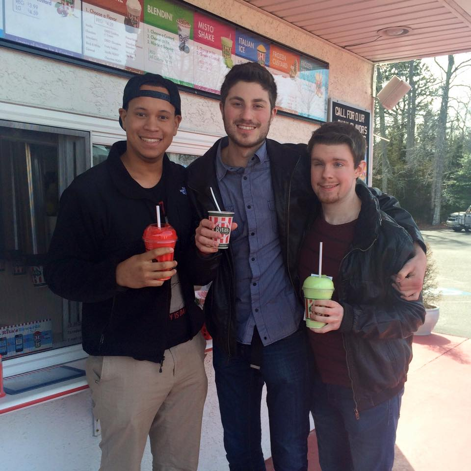
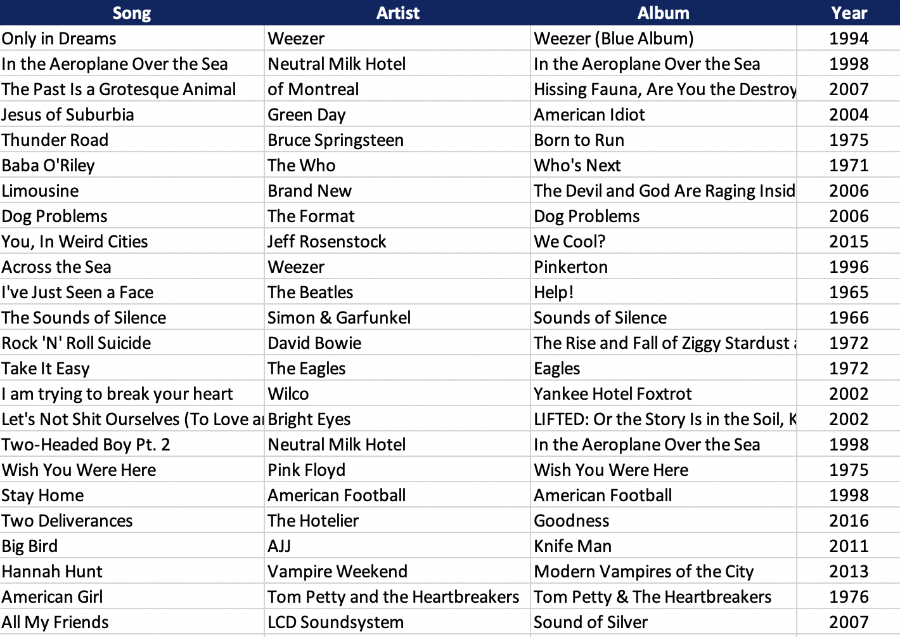

```{r setup, include = FALSE}
knitr::opts_chunk$set(echo = TRUE, warning = FALSE, message = FALSE, fig.width = 10, fig.height = 7)

library(dplyr)
library(tidyverse)
library(ggplot2)
library(janitor)
library(rio)
library(knitr)
library(plotly)
theme_set(theme_minimal())
library(kableExtra)
options(knitr.table.format = "html") 
library(plotly)
```

My two best friends and I challenged each other to list our top 100 favorite songs of all time at the end of 2017. This is by no means an easy task, but the three of us are just the music-obsessed folks to do it. Still, an all-too-obvious thought came to me as I went about logging my 100 tracks: *What an interesting dataset!* So, once I completed my rankings, I tried my hand at visualizing it. 

<p style = "text-align:center;"></p>

<center>My best friends and I in 2014 enjoying some Italian ice before — you guessed it! — a concert. We were such babies! </center>

## Dataset Creation and Import

First thing's first: I had to make a spreadseet. I included the song, artist, album, and year of release right away, but I came up with a couple other ideas as I put my spreadsheet together. 

1. **Genre**: Kind of an obvious one, but I figured it could be interesting. The only thing is, I had to be pretty non-specific when it came to assigning each track a genre. How could I make any reasonable insights from my list if I narrowed in on genre to the point of, say, "emo post-hardcore" or "punk neofolk"? As the great scholars say, granularity often comes at the cost of parsimony. Unfortunately, I had to keep things relatively basic. "Rock" and "alternative" would have to do, as much as it pained me to do it.

2. **Time of discovery**: This is one I'm excited about. I thought about what point in my life I fell in love with each track: childhood, high school, college, or post-grad. Childhood is defined as literally everything before high school, because... well, weren't we all children before high school? 

<p style = "text-align:center;"></p>

<center>A lil' snippet of the spreadsheet I assembled. </center>

```{r import}
d <- import("./songs.csv", setclass = "tibble") %>% 
  clean_names() %>% 
  mutate(row = as.factor(row),
         position = as.factor(position))
```

## Year of Release

The first thing I wanted to do was graph my favorite songs by the year they were released. 

```{r release}
ggplot(d, aes(x = year)) +
  geom_density(fill = "cornflower blue", color = "white", alpha = .8) +
  labs(x = "\nYear\n", 
       y = "Count\n", 
       title = "\nDensity Distribution of Top 100 Songs", 
       subtitle = "Bimodal distribution reveals contemporary taste with some '70s tendencies\n") +
  xlim(1950, 2020) +
  theme(plot.title = element_text(size = 30, face = "bold", hjust = 0.5), 
        plot.subtitle = element_text(size = 15, hjust = 0.5),
        legend.title = element_text(size = 20, face = "bold"),
        legend.background = element_rect(size = .5),
        legend.text = element_text(size = 15),
        axis.text = element_text(size = 15),
        axis.title = element_text(size = 20, face = "bold"))
```

A few interesting observations:

1. My favorite songs largely come from the last couple of decades, which makes sense. Over the past few years, I've tried to keep up with new music releases, so I'm just listening to more current music than classic. 

2. I almost completely skipped over the '80s. There's just a void for almost that entire decade, with one exception (**"Please, Please, Please Let Me Get What I Want"** by The Smiths). I think that's hilarious. But also, maybe I should listen to more '80s music.

3. I'm going to guess that the entire clump of songs from the '60s and '70s is the influence of my classic rock phase in high school.

## Breaking It Down by Decade

Now that we got a macro view of the entire list by year of release, I thought it would be cool to break things down by decade. I can do that using the `cut` command. Since the earliest decade represented in my list is the '60s, we'll start there and make 10-year slices up until the present decade.

```{r decade_cut}
d <- d %>% 
  mutate(decade = cut(year, breaks = c(1959, 1969, 1979, 1989, 1999, 2009, 2019), 
                      labels = c("'60s", "'70s", "'80s", "'90s", "'00s", "'10s"))) %>% 
  group_by(decade) %>% 
  mutate(decade_count = n())
```

Here is my list broken down by decade.

```{r release_decade}
ggplot(d, aes(x = decade, y = decade_count)) +
  geom_bar(stat = "summary", fill = "cornflower blue", alpha = .8) +
  geom_text(aes(label = decade_count), vjust = -.5, size = 6, fontface = "bold") +
  labs(x = "\nDecade\n", 
       y = "Count\n", 
       title = "\nFavorite Songs by Decade of Release", 
       subtitle = "OK, but did the '80s even happen?\n") +
  theme(plot.title = element_text(size = 30, face = "bold", hjust = 0.5), 
        plot.subtitle = element_text(size = 15, hjust = 0.5),
        legend.title = element_text(size = 20, face = "bold"),
        legend.background = element_rect(size = .5),
        legend.text = element_text(size = 15),
        axis.text = element_text(size = 15),
        axis.title = element_text(size = 20, face = "bold"))
```

My tastes are definitely skewed to the contemporary, but the '70s has some nice representation with 15 songs! Also, I've heard some people classify Nirvana as a classic rock band, so I guess even '90s music can be considered "oldies." Ha!

## Genre

Next, I wanted to see my list broken down by genre. Like I mentioned before, the genres aren't nearly as specific as they deserve to be, so take these results with a grain of salt. A genre like "rock," for example, can be broken up so much further. I mean, c'mon, are we talking post-hardcore or proto-metalcore here? `

```{r genre_plot}
d <- d %>% 
  group_by(genre) %>% 
  mutate(genre_freq = n())

ggplot(d, aes(x = reorder(genre, genre_freq), y = genre_freq)) +
  geom_bar(stat = "summary", fill = "cornflower blue", color = "white", alpha = .8) +
  geom_text(aes(label = genre_freq), vjust = -.5, size = 6, fontface = "bold") +
  labs(x = "\nGenre", 
       y = "Count\n", 
       title = "\nFavorite Songs by Genre", 
       subtitle = "A frequency distribution that screams 'white dude'\n") +
  theme(plot.title = element_text(size = 30, face = "bold", hjust = 0.5), 
        plot.subtitle = element_text(size = 15, hjust = 0.5),
        legend.title = element_text(size = 20, face = "bold"),
        legend.background = element_rect(size = .5),
        legend.text = element_text(size = 15),
        axis.text = element_text(size = 15),
        axis.title = element_text(size = 20, face = "bold"))
```

Talk about a "diverse" set of music... It looks like 80% of my list is composed of music that can be classified, at least loosely, as rock, alternative, and punk. 

## Period of Discovery

Finally, I wanted to look at the distribution of songs from the period of time in my life I first discovered them. I looked specifically at childhood, high school, college, and post-grad. I'm really excited — and terrified — to see what this one looks like!

```{r discovery}
d$discovery <- factor(d$discovery, levels = c("Childhood", "High School", "College", "Post-Grad"))

d <- d %>% 
  group_by(discovery) %>% 
  mutate(disc_freq = n())

ggplot(d, aes(x = discovery, y = disc_freq)) +
  geom_bar(stat = "summary", fill = "cornflower blue", color = "white", alpha = .8) +
  geom_text(aes(label = disc_freq), vjust = -.5, size = 6, fontface = "bold") +
  labs(x = "\nPeriod of Discovery\n", 
       y = "Count\n", 
       title = "\nFavorite Songs by Period of Discovery", 
       subtitle = "As the adage goes, college is an important time in one's life\n") +
  theme(plot.title = element_text(size = 30, face = "bold", hjust = 0.5), 
        plot.subtitle = element_text(size = 15, hjust = 0.5),
        legend.title = element_text(size = 20, face = "bold"),
        legend.background = element_rect(size = .5),
        legend.text = element_text(size = 15),
        axis.text = element_text(size = 15),
        axis.title = element_text(size = 20, face = "bold"))
```

It looks like a vast majority (nearly 50%) of my favorite songs came from college. What a formative four years those were... 

Thinking about it more, this is pretty obvious. Those two best friends I mentioned at the very beginning of this document, the ones who started this year-end list-making tradition with me, I met them my freshman year of college. They know a lot more about music than I ever will, and they introduced me to so many of the songs on this list. My taste in music — and so much more — would not be the same without them.

In sum, you're damn right I discovered most of my picks in college, and with the help of some good friends.

### Genre of Favorite Songs by Period of Discovery

That's revealing enough, but let's see what the genre breakdown looks like for each of my four periods of discovery. Was I really as fixated on classic rock in high school as I suspect I was? Have I broadened my horizons at all since?

```{r discovery_plot2}
d <- d %>% 
  group_by(discovery, genre) %>% 
  mutate(specific = n())

ggplot(d, aes(x = discovery, y = genre, fill = specific)) +
  geom_tile(alpha = .8) +
  labs(x = "\nPeriod of Discovery\n", 
       y = "Genre\n", 
       fill = "Count", 
       title = "Favorite Songs by Genre and Time of Discovery", 
       subtitle = "My tastes have gotten more diverse over time, but only marginally\n") +
  theme(plot.title = element_text(size = 30, face = "bold", hjust = 0.5), 
        plot.subtitle = element_text(size = 15, hjust = 0.5),
        legend.title = element_text(size = 20, face = "bold"),
        legend.text = element_text(size = 15),
        axis.text = element_text(size = 15),
        axis.title = element_text(size = 20, face = "bold"))
```

As this reveals, the answer to both of my hypothetical questions from above is a resounding **YES**. Seriously, 18 entries on my list are rock songs I discovered in high school. I have thankfully diversified my listening in the years since, albeit not by too much. There is a spike in alternative entries from the college years, for example.

## Heat Maps

All this talk about my list, and I haven't even explored the rankings themselves. What musical decades tend to be represented most at the top of my list? At what stage of life did I first discover my absolute favorite tracks? 

While actually coding the following plots took only a matter of minutes, I'd been thinking of how to do it for weeks. It was like an insight problem: the solution came to me in a flash one Sunday afternoon.

Essentially, I created two new variables in my spreadsheet: *row* and *position*. What these codes did in tandem was supply R a set of "coordinates" to place an individual track as its own square on a 10x10 grid. For example, the #1 song should appear as a single square in the top left-hand corner of the plot, followed by the #2 track immediately to its right. 

The plot reads like a book: Tracks #1-10 go in decreasing order from left to right on the top-most row. Then, the second group of 10 tracks (#11-20) appears in decreasing order from left to right on the row underneath. So on and so forth...

First, let's look at where on my list the different musical decades tend to be represented.

### Rankings Colored by Decade of Release

```{r heat_map_1}
ggplot(d, aes(x = position, y = row, fill = decade)) +
  geom_tile(color = "white", size = .5) +
  scale_y_discrete(labels = c("10" = "#1-10", "9" = "#11-20", 
                              "8" = "#21-30", "7" = "#31-40",
                              "6" = "#41-50", "5" = "#51-60",
                              "4" = "#61-70", "3" = "#71-80",
                              "2" = "#81-90", "1" = "#91-100")) +
  coord_equal() +
  scale_x_discrete(breaks = NULL) +
  scale_fill_brewer(palette = "RdYlBu") +
  labs(title = "\nRankings: Colored by Decade of Release\n", fill = "Decade") +
  theme(plot.title = element_text(size = 30, face = "bold", hjust = 0.5), 
        plot.subtitle = element_text(size = 15, hjust = 0.5),
        legend.title = element_text(size = 20, face = "bold"),
        legend.text = element_text(size = 15),
        axis.text = element_text(size = 15),
        axis.title = element_blank())
```

Super cool! It's especially interesting to me that of my '60s and '70s favorites on this list, a majority of them tend to be closer to the top of it. Over one-third of my top 30 tracks were released in those decades! As established above, I was in the midst of somewhat of a classic rock obsession in high school. 

If that's the case, perhaps songs I discovered earlier in life are just closer to the heart. In other words, it's because I listened to those '60s and '70s songs earlier in life that they find their way so high on my list. Let's find out by reproducing the same visualization as we have here, but with tracks colored by period of discovery instead of decade of release.

### Rankings Colored by Period of Discovery

```{r heat_map_2}
ggplot(d, aes(x = position, y = row, fill = discovery)) +
  geom_tile(color = "white", size = .5) +
  scale_y_discrete(labels = c("10" = "#1-10", "9" = "#11-20", 
                              "8" = "#21-30", "7" = "#31-40",
                              "6" = "#41-50", "5" = "#51-60",
                              "4" = "#61-70", "3" = "#71-80",
                              "2" = "#81-90", "1" = "#91-100")) +
  coord_equal() +
  scale_x_discrete(breaks = NULL) +
  scale_fill_brewer(palette = "RdYlBu") +
  labs(title = "\nRankings: Colored by Time of Discovery\n", fill = "Decade") +
  theme(plot.title = element_text(size = 30, face = "bold", hjust = 0.5), 
        plot.subtitle = element_text(size = 15, hjust = 0.5),
        legend.title = element_text(size = 20, face = "bold"),
        legend.text = element_text(size = 15),
        axis.text = element_text(size = 15),
        axis.title = element_blank())
```

Sure enough, exactly half of my top 30 songs came from childhood and high school. Not only that, but six of my top 10 tracks came from those early periods of discovery! The influence of college can't be overlooked, though. But those tracks are mixed pretty evenly all throughout the top 100.

## The Ranked List

OK, you've been very patient. After all that, I finally give to you the completed ranked list of my 100 favorite songs of all time, as of 2017. There's even a Spotify playlist embedded in this very document, with all the songs in their correct order for your listening pleasure!

I initially made this document at the end of 2017, after the first term of my PhD program. It's amazing how much I've learned only a year later. I'd never seen myself as a coder or data scientist before grad school, but my program has taught me that anticipated difficulty is no reason to shy away from something new, especially if it's something you care enough about. 

<iframe src="https://open.spotify.com/embed/user/1231312236/playlist/1X0ICzJp8Y6Jt1EWDUP9ot" width="930" height="380" frameborder="10" allowtransparency="true"></iframe>