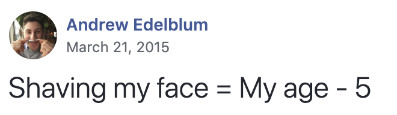
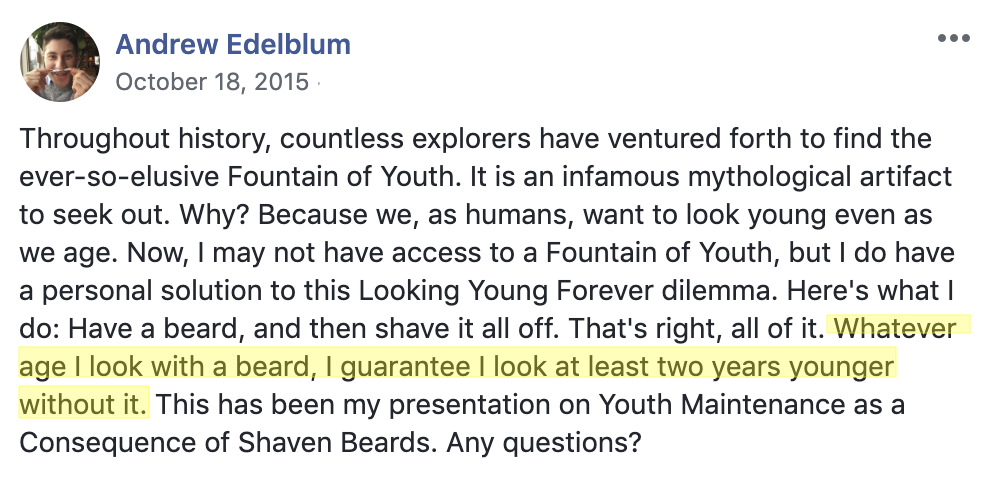
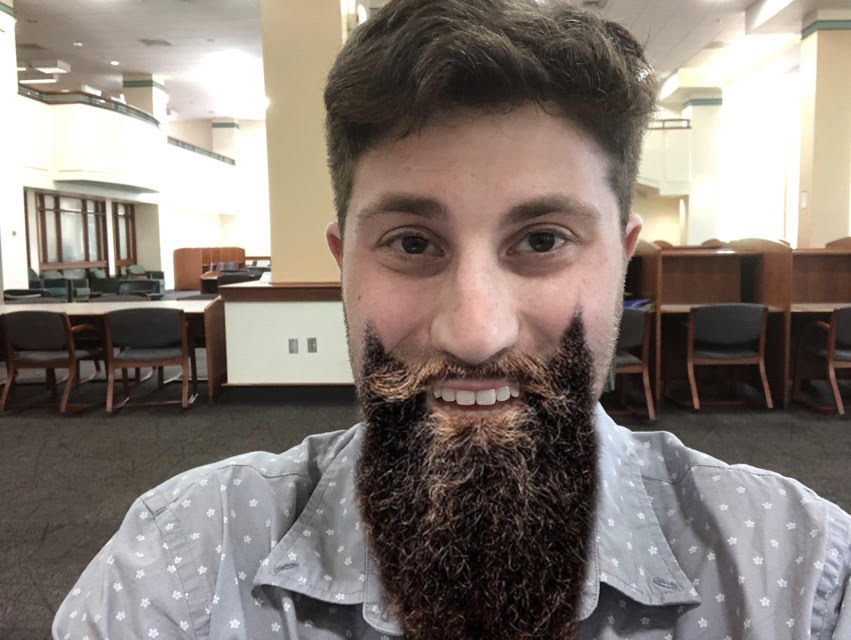
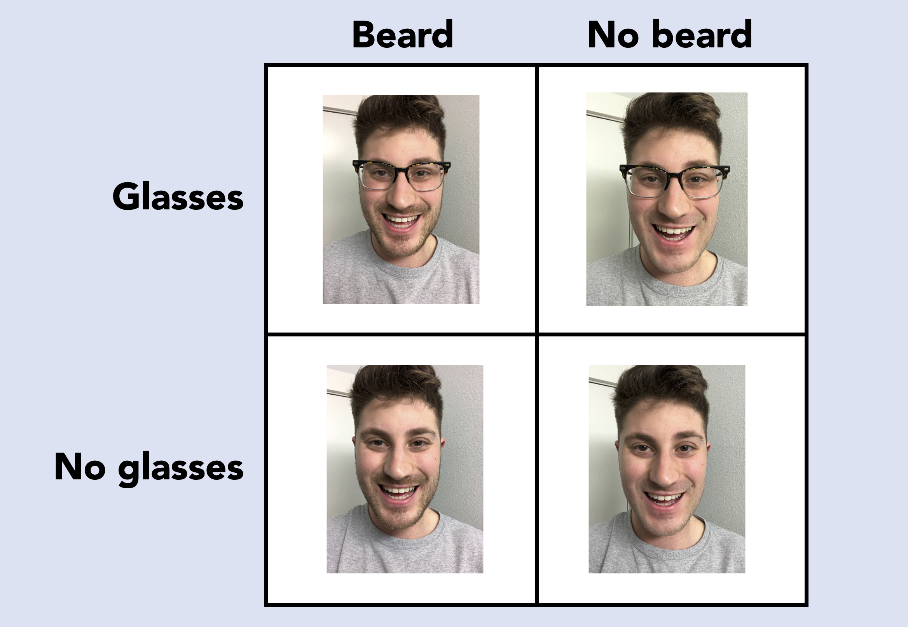
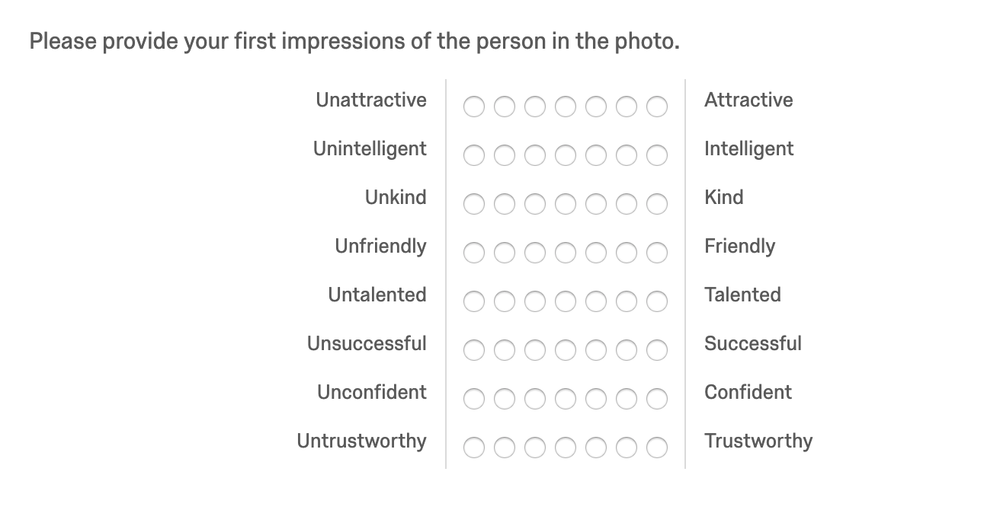
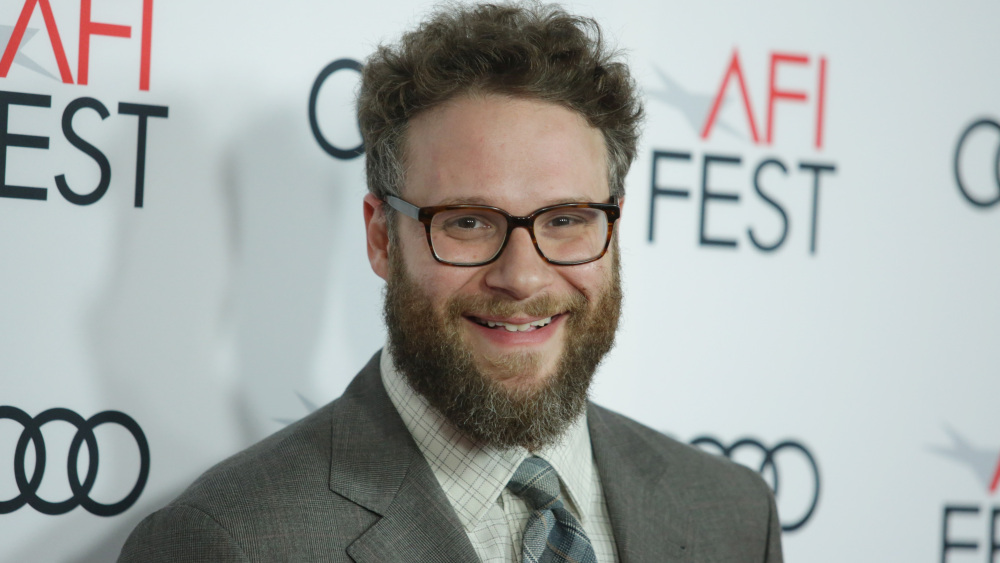

```{r setup, include = FALSE}
knitr::opts_chunk$set(echo = FALSE, warning = FALSE, message = FALSE, fig.align = "center", fig.width = 10, fig.height = 9, tidy.opts = list(width.cutoff = 60), tidy = TRUE)

library(rio)
library(tidyverse)
library(dplyr)
library(janitor)
library(ggplot2)
theme_set(theme_minimal())
library(knitr)
library(kableExtra)
library(ggthemes)
library(colorblindr)
library(outliers)

d <- import("./d.csv", setclass = "tibble") %>% 
  clean_names() %>% 
  rename(attractive = impressions_1,
         intelligent = impressions_2,
         kind = impressions_3,
         friendly = impressions_4,
         talented = impressions_5,
         successful = impressions_6,
         confident = impressions_7,
         trustworthy = impressions_8) %>% 
  mutate(beard = as.factor(beard),
         beard = recode(beard, "1" = "Beard", "0" = "No Beard"),
         glasses = as.factor(glasses),
         glasses = recode(glasses, "1" = "Glasses", "0" = "No Glasses"),
         gen = factor(gen),
         gen = recode(gen, "1" = "Male", "2" = "Female")) %>% 
  filter(age != 556)
```

On March 24, 2015, Facebook introduced a new feature to its platform called **On This Day**, a one-stop showcase of all your posts on the current date from years past. If you want to know what you posted on Facebook on this *exact* date two years ago, On This Day — dubbed **Memories**, as of 2018 — is your easy way to do it. 

Having access to these "memories" is fun and, at times, embarrassing. It reminds you of as many clever posts you wrote as ones you'd rather go on forgetting. "Did I really post *that*? What was I thinking?" Yes, the data indexing in our modern social media landscape is both grand and terrifying, isn't it?

My Facebook Memories are often in the latter category, so it's become somewhat of a masochistic ritual of mine to read my Memories every morning. A couple months ago, I was scrolling through my Facebook Memories for the day when I came across a silly post I shared in 2015.

<p style = "text-align:center;"></p>

*Funny*, I thought. I'd always thought I had a young face. This Facebook status was certainly some bitter reflection on how I thought I needed some amount of facial hair to "look my age." Besides, I'd just turned 21 when I posted it and felt bruised about getting carded at some of my favorite New Jersey bars. This appeared to happen more when I had a clean-shaven face than when I had a faint mustache / beard combo. 

Now, a couple years ago, I would have glanced at this status, chuckled, and moved on with my day. But graduate school has influenced my thinking in more ways than I can count. So, with my "apprentice data scientist" hat equipped, I came to see this Facebook status in a new light: *This is a statistical hypothesis that can be tested empirically.*

## Creating a Testable Research Question from a Facebook Status

### The Regression Equation and Terms

I thought about the terms a bit and came up with the following regression equation for what I planned to investigate.

$$PerceivedAge_{i} = \beta_0 + \beta_1Beard_i + \epsilon_i$$

The above equation is designed to assess how old people think I am on the basis of having vs. not having a beard. Please excuse me as I walk through a STATS 101 description of what these terms mean, so we're all on the same page. 

- ${Beard}$ = a binary "dummy" variable coded as 0 or 1, where 0 = shaven, 1 = beard.
- ${\beta_0}$ = my perceived age when beard = 0.
- ${\beta_1}$ = the change in perceived age associated with having (vs. not having) a beard, i.e., when ${Beard}$ increases from 0 to 1.
- ${\epsilon}$ = error, or the average distance between how old people actually think I am and what my regression predicts.

### The Hypotheses

Now, my original Facebook status makes a few interesting assertions. We'll call these "hypotheses." 

- $H_1$: I will look five years older with (vs. without) a beard. 
- $H_2$: Having a beard will not add years to my *perceived* age — but rather mitigate the threat of looking younger than my *current* age. In other words, having a beard will make me look like my actual age, whereas shaving will reduce my perceived age by five. 

Using formal terms:

- $H_1$: ${\beta_1}$ = 5. Or: the change in perceived age associated with having (vs. not having) a beard will be +5.
- $H_2$: ${\beta_0}$ = 20. Or: I will look five years younger than my current age (25) without a beard.

Funny enough, I posted a *second* Facebook status on the subject of beards later in 2015 with a less extreme hypothesis.

<p style = "text-align:center;">

*"Whatever age I look [like] with a beard, I guarantee I look at least two years younger without it."* **At least** two years... Would you look at that? It sounds like my 21 year-old self was talking confidence intervals. I set a lower bound of two, meaning I anticipated a minimum two-year age differential between having vs. not having a beard.

## Designing an Experiment to Test the Effect of Having a Beard on My Perceived Age

Now comes the fun part. How to test these hypotheses?

The solution was simple: create a quick Qualtrics survey in which I randomly assign participants to look at a picture of me, either with or without a beard. Then, have those participants guess my age. Assuming no other differences between conditions, whatever change in perceived age I detect between conditions should be explained by the presence vs. absence of my beard (**BEARD**). 

### The Stimuli

But, again, this assumes all else being equal, *ceteris paribus*. To ensure the validity of drawing such conclusions, I needed to make the two pictures of me as similar as possible. I couldn't just use bearded vs. beardless pictures of me that already exist, as a number of confounding factors beyond **BEARD**, e.g., lighting, facial expression, etc., would have the possibility of explaining any emerging statistical trends.

Instead, I'd have to take *current* pictures of myself, both before and after shaving, while also making sure to have them come out as similar as possible. Same lighting. Same facial expression. Same photo composition and framing. The works.

This is much harder than it sounds. Plus, there were a couple times I tried taking these photos, only to be dissatisfied with the result. Unfortunately, there's no "undo" button for shaving, so I had to wait another couple weeks for my beard to grow in before trying again.

Here's what I settled on.

<p style = "text-align:center;"></p>

Now, I can already hear the critiques: First, there are some construct validity issues to discuss. In the beardless picture, I'm not clean-shaven. And, in the bearded picture, it looks more like I have a scattered dusting of facial hair than what experts might formally recognize as a "beard." How can I purport to be measuring the influence of having a beard if I don't even have a "real" beard in the picture? I acknowledge this concern. However, I promise these photos are the best ones for me to use. Why?

- **Ecological validity**: I never have a full-on ZZ Top beard, nor do I often take to my face with a close-shaving manual razor. In turn, these images represent what *I* mean when I say beard vs. no beard. They're how *I* choose to present myself — and I'd much rather test that than whatever this is (courtesy of a silly photo filter).

<p style = "text-align:center;">

- **Conservative test of concept**: By this I mean the differences in images are so slight, so subtle, that detecting any significant difference in outcomes between them would be a good indictor of some effect. In other words, if there's a difference in perceived age with *these* photos, just imagine what the effect might look like if I had a beard similar to the one in the photo filter above.

Finally, there's the threat of internal validity, because, well, these images aren't *exactly* identical — with the exception of the beard. But at the same time, these are selfies I took in my apartment bathroom for a silly research project I did for fun, so... let a grad student live. 

### The Case for Glasses as a Second Exploratory Factor

Already, this project has some decent curiosity going for it. Answer a prevailing question raised by my college-age self about the relationship between facial hair and perceived age. Sounds interesting enough, right?

Well, a main effect of having a beard wasn't enough for me. I wanted to add a second factor to the mix, which is where glasses come in. More specifically, does wearing vs. not wearing glasses affect how old people think I am? Or, even more interesting, does wearing glasses interact with having a beard, such that I look older with a beard when I'm *not* wearing glasses and older without a beard when I *am* wearing glasses? (Note: I acknowledge that this last sentence sounds like word salad, but such is the nature of statistical interactions.)

While I don't have any Facebook statuses to motivate this aspect of my design, I have personal reasons to include glasses as an exploratory factor. Most notably, friends have told me I look professional and scholarly when I wear them. (I think they're just being nice. Perhaps the data from impartial strangers will suggest otherwise.)

So, without further ado, here is the 2 (beard: yes vs. no) $\times$ 2 (glasses: yes vs. no) taxonomy I created for the current study.

<p style = "text-align:center;"></p>

### The Survey

With hypotheses specified and stimuli generated, it was time to create my Qualtrics survey. I already described the basic gist of it above, but there are some as yet unmentioned details that I think are worth describing here. Allow me to fully detail the methods and measures I used. 

```{r dems}
# Age descriptives
d %>% 
  summarize(mean_age = mean(age),
            sd_age = sd(age))

# Gender frequencies
d %>% 
  group_by(gen) %>% 
  summarize(n = n())
```

*Participants.* A total of 199 U.S. participants (44.44% female, $M_{age}$) = 36.00, ($SD_{age}$) = 12.30),  from Amazon's Mechanical Turk took this brief survey in exchange for \$0.10 each. (That's right: I invested my own personal money into this project. That's how committed I am to uncovering the #truth.) 

*Photo stimulus.* Participants were randomly assigned to look at one of four images of me (see above) for a total of 10 seconds. I set a timer to auto-advance participants to the next part of the survey after the time elapsed. 

*Perceived age measure.* I next asked participants to indicate how old they thought I was based on the picture of me to which they were assigned. For this task, I used a slider scale that ranged from 0-100 years of age. I perhaps could have narrowed the scale to a more reasonable range of ages — why have the scale at a maximum value of 100 years old? — but I did not want to bias participants' gut evaluations. The idea was for the perceived age ratings to be a consequence of the image stimulus, not the measurement instrument.

*Exploratory trait measures.* As I have already established, I wanted to milk this study for all it was worth. So, in addition to the focal perceived age measure, I also included exploratory measures pertaining to a grab bag of traits. For example, what is the optimal combination of beard and glasses to maximize my attractiveness? My perceived intelligence? My perceived trustworthiness? I used a bipolar scale for all items here, to reflect the presence of a given positive trait, as well as that of its exact opposite (e.g., friendly vs. unfriendly). Here is a screenshot of all the traits I used.

<p style = "text-align:center;"></p>

*Open-ended first impressions.* This was a late addition to the survey, but one I am so glad I thought to include. I was afraid my earlier measures were a bit sterile. They're scales with a constrained numerical range. An open-ended text box ought to spice things up. With this open-ended response question, I let participants go wild and provide any additional first impressions they had of me based on the photo stimulus to which they were exposed. **Spoiler alert**: I'll be doing my first-ever textual analysis with this data later, which has me very excited.

*Demographics.* As is typical in many a survey. **Spoiler alert**: I will look to see if gender further influences the BEARD $\times$ GLASSES interaction later on, because I'm a young bachelor who cares about these things. 

## The Results: What You All Skipped Ahead to See

### Data Import and Cleaning

Phew! That was a lot of setting the scene to do, but I think we're finally ready to delve into the code and results. First, I renamed my variables and factor levels to be as descriptive and intuitive as possible.

### Outlier Removal

Remember how I set the perceived age measure to a sliding scale of 0-100? This surely reduced bias from participants' ratings, but it also functioned as somewhat of an attention check. After scanning the data for this variable, I noticed some absolutely *bonkers* age estimates. Here are a few of them.

```{r remove}
tail(sort(d$age_guess_2))
```

Those numbers represent how many years old some participants said I was. There is no way anyone would reasonably guess I am a 93 year-old man. I thus felt good about checking for outliers and removing them from subsequent analyses. So, I extracted the outlier values for `perceived_age` and graphed them with a quick boxplot.

```{r boxplot}
# Extract outlier values
outlier_values <- sort(boxplot.stats(d$age_guess_2)$out)

# Plot boxplot for perceived age
boxplot(d$age_guess_2, main = "Perceived Age", cex.main = 3, cex.axis = 1.5, cex = 1.5, boxwex = 0.5)
```

Thankfully, it looks like *most* of my participants were paying attention to the survey, as a majority of perceived age estimates appear to be in the the right ballpark (i.e., mid-20s, early 30s). Still, there were a total of 19 extreme values. I filtered my dataset to exclude the participants who entered these values.

```{r filter}
d <- d %>% 
  filter(age_guess_2 > 1 & age_guess_2 < 41)
```

That brought the final *N* to 179 participants.

### The Main Effect of Having a Beard on Perceived Age

Let's start with answering my original research questions: Does having a beard make me look my age? Does losing the beard make me look five years younger? 

I'll generate summary statistics and run the basic model.

```{r beard_model}
summary <- d %>% 
  group_by(beard) %>% 
  summarize(n = n(),
            mean = mean(age_guess_2),
            sd = sd(age_guess_2),
            se = plotrix::std.error(age_guess_2))

summary

model <- lm(age_guess_2 ~ beard, data = d)
summary(model)
```

Wow. It looks like both of my hypotheses were very wrong. The model results indicate that participants thought I looked a little more than 26 years old without a beard and only marginally older with one (*b* = .96, *t*(177) = 1.48, *p* = .14). This directionally conforms to my expectations, but the magnitude of the "beard effect" is nowhere near as great as my 21 year-old self expected. 

On a positive note, I find it oddly validating that an amalgam of random strangers came close to guessing my actual age. Such is the wisdom of crowds, I suppose. In fact, the crowd overshot my actual age by a couple of years. So much for having a young face!

We can plot this for a nice visualization.

```{r beard_plot}
pd <- position_dodge(.9)

ggplot(summary, aes(x = beard, y = mean)) +
  geom_bar(stat = "identity", position = "dodge", fill = "cornflower blue", width = .5, alpha = .7) +
  geom_hline(yintercept = 25, size = 1, color = "purple", linetype = "dashed") +
  geom_errorbar(aes(ymin = mean + qnorm(0.025) * se,
                    ymax = mean + qnorm(0.975) * se),
                position = pd, width = 0.1) +
  coord_cartesian(ylim = c(20, 30)) +
  labs(x = "Beard", y = "Age", title = "Does Having a Beard Make Me Look Older?", subtitle = "Yes, by a little less than a year of age", caption = "Dashed line indicates current age = 25") +
  theme(plot.title = element_text(size = 30, face = "bold", hjust = 0.5), 
        plot.subtitle = element_text(size = 15, hjust = 0.5),
        axis.text = element_text(size = 15),
        strip.text = element_text(size = 15),
        axis.title = element_text(size = 18, face = "bold"),
        plot.caption = element_text(size = 15))
```

### The Main Effect of Wearing Glasses on Perceived Age

What about glasses? Some research has found, unsurprisingly, that glasses influence social perceptions for characteristics like intellect and goodness of heart (Hellstrom and Tekle 1994). But do they affect perceived age, too? Let's test it!

```{r glasses_model}
summary <- d %>% 
  group_by(glasses) %>% 
  summarize(n = n(),
            mean = mean(age_guess_2),
            sd = sd(age_guess_2),
            se = plotrix::std.error(age_guess_2))

summary

model <- lm(age_guess_2 ~ glasses, data = d)
summary(model)
```

The answer in my case is *no*. On average, I looked just shy of 27 years old without glasses, and wearing glasses upped that by only a fraction of a year (*b* = .14, *t*(178) = .18, *p* = .781). So, there you have it: According to my sample, wearing glasses makes me look approximately a month and a half older than without them. I'll plot this, too.

```{r glasses_plot}
ggplot(summary, aes(x = glasses, y = mean)) +
  geom_bar(stat = "identity", position = "dodge", fill = "cornflower blue", width = .5, alpha = .7) +
  geom_hline(yintercept = 25, size = 1, color = "purple", linetype = "dashed") +
  geom_errorbar(aes(ymin = mean + qnorm(0.025) * se,
                    ymax = mean + qnorm(0.975) * se),
                position = pd, width = 0.1) +
  scale_fill_OkabeIto() +
  coord_cartesian(ylim = c(20, 30)) +
  labs(x = "Glasses", y = "Age", title = "Does Wearing Glasses Make Me Look Older?", subtitle = "Not really at all — only by a fraction of a year of age", caption = "Dashed line indicates current age = 25") +
  theme(plot.title = element_text(size = 30, face = "bold", hjust = 0.5), 
        plot.subtitle = element_text(size = 15, hjust = 0.5),
        axis.text = element_text(size = 15),
        strip.text = element_text(size = 15),
        axis.title = element_text(size = 18, face = "bold"),
        plot.caption = element_text(size = 15))
```

### The Combined Effect of Facial Hair and Glasses on Perceived Age

So far, we've looked at the main effects of both BEARD and GLASSES, but do these two factors interact? In formal terms, here is what I mean.

$$PerceivedAge_{i} = \beta_0 + \beta_1Beard_i + \beta_2Glasses_i + \beta_3Beard_iGlasses_i + \epsilon_i$$

I'll start by generating the descriptive stats and running the BEARD $\times$ GLASSES model.

```{r interaction_stats}
summary <- d %>% 
  group_by(beard, glasses) %>% 
  summarize(n = n(),
            mean = mean(age_guess_2),
            sd = sd(age_guess_2),
            se = plotrix::std.error(age_guess_2))

summary

model <- lm(age_guess_2 ~ beard * glasses, data = d)
summary(model)
```

The omnibus test was not significant. Plus, because this was an exploratory analysis, I cannot interpret my coefficients. However, there are still some insights we can glean from these results. I'll plot the data first.

```{r interaction_plot}
ggplot(summary, aes(x = beard, y = mean, fill = glasses)) +
  geom_bar(stat = "identity", position = "dodge", alpha = .7) +
  geom_hline(yintercept = 25, size = 1, color = "purple", linetype = "dashed") +
  geom_errorbar(aes(ymin = mean + qnorm(0.025) * se,
                    ymax = mean + qnorm(0.975) * se),
                position = pd, width = 0.2) +
  scale_fill_OkabeIto() +
  coord_cartesian(ylim = c(20, 30)) +
  labs(x = "Beard", y = "Perceived Age", fill = "Glasses", title = "Age, re: Beard + Glasses", subtitle = "When I'm not wearing glasses, having a beard makes a noticeable difference", caption = "Dashed line indicates current age = 25") +
  theme(plot.title = element_text(size = 30, face = "bold", hjust = 0.5), 
        plot.subtitle = element_text(size = 15, hjust = 0.5),
        legend.title = element_text(size = 20, face = "bold"),
        legend.text = element_text(size = 15),
        axis.text = element_text(size = 15),
        strip.text = element_text(size = 15),
        axis.title = element_text(size = 18, face = "bold"),
        plot.caption = element_text(size = 15))
```

First, let's talk basic findings. Participants thought I was the oldest when they saw me with a beard and no glasses (*M* = 27.50, *SD* = 4.38) and the youngest when they saw me with no beard and no glasses (*M* = 26.00, *SD* = 4.12). Still, all conditions thought I was, on average, older than my actual age (25).

Also, despite the non-significant results, we do see somewhat of a crossover interaction emerge. This appears to be driven mostly by the effect of **BEARD** when I'm not wearing glasses. Look at those orange bars! Having a beard seems to have the greatest impact on my perceived age when I'm not wearing glasses. I'll have to keep all this in mind the next time I visit my favorite happy hour spots in New Jersey and Oregon. 

### How Should I Maximize My Perceived Attractiveness?

Now comes the exploratory attribute I can't help but test on its own: perceived attractiveness. Buzzfeed has already posted a veritable cornucopia of articles about the aesthetic advantage of having a beard. They cite [John Krasinski and Donald Glover as exemplars of this look](https://www.buzzfeed.com/eleanorbate/i-like-your-beard) (Bate 2016). The argument: Better with a beard.

Meanwhile, the findings for glasses are bit mixed. Adolescents tend to associate glasses with nerdiness and, thus, social undesirability. But such stigma does not last forever. [In fact, some people find nerdiness attractive in its own right](https://thoughtcatalog.com/erica-gordon/2016/05/heres-why-women-love-geeks-dorks-and-nerds/). Gordon (2016), for instance, asserts that, "Having interesting passions and unique hobbies — even geeky ones — makes you super attractive." Perhaps favorability for glasses is a signal of nerdiness, thereby boosting perceived attractiveness.

With the above speculation in mind, I tested BEARD, GLASSES, and their interaction as predictors of perceived attractiveness. Here is what I found.

```{r attractive_stats}
summary <- d %>% 
  group_by(beard, glasses) %>% 
  summarize(n = n(),
            mean = mean(attractive),
            sd = sd(attractive),
            se = plotrix::std.error(attractive))

summary

model <- lm(attractive ~ beard * glasses, data = d)
summary(model)
```

Again, no significant results, but we do see a marginal effect of BEARD on perceived attractiveness (*b* = .53, *t*(176) = 1.77, *p* = .078). I can't formally interpret this result, but I *can* say it looks like having a beard makes me look more attractive when I'm not wearing glasses. Plus, having a beard seems pretty advantageous for perceived attractiveness overall. John Krasinski, I'm coming for you! 

```{r attractive_plot}
ggplot(summary, aes(x = beard, y = mean, fill = glasses)) +
  geom_bar(stat = "identity", position = "dodge", alpha = .7) +
  geom_errorbar(aes(ymin = mean + qnorm(0.025) * se,
                    ymax = mean + qnorm(0.975) * se),
                position = pd, width = 0.2) +
  scale_fill_OkabeIto() +
  labs(x = "Beard", y = "Attractiveness", fill = "Glasses", title = "Attractiveness, re: Beard + Glasses", subtitle = "I am seen as most attractive with a beard and no glasses") +
  theme(plot.title = element_text(size = 30, face = "bold", hjust = 0.5), 
        plot.subtitle = element_text(size = 15, hjust = 0.5),
        legend.title = element_text(size = 20, face = "bold"),
        legend.text = element_text(size = 15),
        axis.text = element_text(size = 15),
        strip.text = element_text(size = 15),
        axis.title = element_text(size = 18, face = "bold"))
```

### Moderating for Gender

What kind of consumer psychologist would I be if I didn't try moderating for gender? Do men and women feel differently about my ideal combination of beard and glasses?

```{r moderation}
summary <- d %>% 
  group_by(gen, beard, glasses) %>% 
  summarize(n = n(),
            mean = mean(attractive),
            sd = sd(attractive),
            se = plotrix::std.error(attractive))

summary

model <- lm(attractive ~ gen * beard * glasses, data = d)
summary(model)
```

Beyond a significant omnibus *F*-test (*p* = .005), we see an absolutely different pattern of effects emerge for women than for men. Plotting will help to visualize this.

```{r moderation_plot}
ggplot(summary, aes(x = beard, y = mean, fill = glasses)) +
  geom_bar(stat = "identity", position = "dodge", alpha = .7) +
  geom_errorbar(aes(ymin = mean + qnorm(0.025) * se,
                    ymax = mean + qnorm(0.975) * se),
                position = pd, width = 0.2) +
  facet_wrap(~gen) +
  scale_fill_OkabeIto() +
  labs(x = "Beard", y = "Attractiveness", fill = "Glasses", title = "Attractiveness, re: Beard + Glasses", subtitle = "Very different pattern of effects for men and women") +
  theme(plot.title = element_text(size = 30, face = "bold", hjust = 0.5), 
        plot.subtitle = element_text(size = 15, hjust = 0.5),
        legend.title = element_text(size = 20, face = "bold"),
        legend.text = element_text(size = 15),
        axis.text = element_text(size = 15),
        strip.text = element_text(size = 15),
        axis.title = element_text(size = 18, face = "bold"))
```

I'll break this down for men and women:

Whether or not I had a beard, men found me more attractive when I *wasn't* wearing glasses. In fact, the combination of beard and glasses is what men found *least* attractive (*M* = 3.67, *SD* = 1.37). Meanwhile, women found that exact combination the *most* attractive (*M* = 5.17, *SD* = 1.52). This is curious. Let me know if you have any theoretical foundation as to why this pattern of effects would occur.

Perhaps any cross-comparisons between men and women in this regard are biased. Predictably, attractiveness ratings were higher overall among females than males, as men presumably found it uncomfortable to call a strange man on the Internet "attractive." Men in this sample may have therefore reduced their attractiveness ratings to preserve their masculinity. *"If I recognize this dude as attractive, it makes me less of a man. We can't have that."*

Such bias could have been reduced if I'd asked participants to rate my "handsomeness" as opposed to "attractiveness," although it is debatable whether these constructs actually mean the same thing in their colloquial use.

Regardless, my conclusion upon reviewing these results is... maybe wear glasses more. 

### Assemblage of Exploratory Traits

In addition to attractiveness, I asked participants to rate me on a variety of exploratory traits, from kindness to successfulness. While there weren't any interesting differences based on my facial aesthetic choices, it's still interesting to look at the general trends in what complete strangers on the Internet thought of me from a single picture. Let's look at the descriptives for these attributes.

```{r explore_ridges}
library(ggridges)

ridges <- d %>% 
  select(intelligent:trustworthy, beard, glasses) %>%  
  mutate(positive = (intelligent + kind + friendly + talented + successful + confident + trustworthy)/7) %>% 
  gather("question", "value", 1:7)

ridges %>% 
  group_by(question) %>% 
  summarize(mean = mean(value),
            sd = sd(value))
```

Next, I'll plot the density distribution of ratings for each of these attributes with `ggridges`. 

```{r ridges}
library(ggridges)

capitalize <- function(string) {
  substr(string, 1, 1) <- toupper(substr(string, 1, 1))
  string
}

ridges$question <- capitalize(ridges$question)

ggplot(ridges, aes(x = value, y = question)) + 
  geom_density_ridges(rel_min_height = 0.01, fill = "cornflower blue", alpha = .7) +
  coord_cartesian(xlim = c(0, 7.5)) +
  geom_vline(xintercept = mean(ridges$positive), size = 1.5, linetype = "dashed", color = "purple") +
  scale_fill_OkabeIto() +
  scale_x_discrete(limits = c(0, 1, 2, 3, 4, 5, 6, 7)) +
  labs(x = "Impression", y = "Trait", fill = "Glasses", title = "Ratings on Exploratory Traits", subtitle = "People generally found me kind- and friendly-looking", caption = "Dashed line indicates average rating across all traits = 5.21") +
  theme(plot.title = element_text(size = 30, face = "bold", hjust = 0.5), 
        plot.subtitle = element_text(size = 15, hjust = 0.5),
        legend.title = element_text(size = 20, face = "bold"),
        legend.text = element_text(size = 15),
        axis.text = element_text(size = 15),
        strip.text = element_text(size = 15),
        axis.title = element_text(size = 18, face = "bold"),
        plot.caption = element_text(size = 15))
```

The dashed line in the `ggridges` plot above signifies the average rating participants gave me across all traits (*M* = 5.21). It makes for a useful reference point in eyeballing the results. Looking at the density distributions for the seven exploratory traits, it looks like there is left skew to the more pro-social attributes listed here (e.g., "kind," "friendly"). This could be chalked up to the fact that I was smiling in all the pictures, however. 

There is comparatively more right skew to the attributes pertaining to my success and ability (e.g., "talented," "successful"). In fairness, these traits are difficult to ascertain from a mere picture, so it makes sense that ratings here were a bit on the lower side.

## Textual Analysis

Let's end on a bang. As a last bit of unfinished business, I thought I'd detail some of the interesting open-ended responses I received when I asked participants to describe any additional first impressions they had of me. 

A few themes emerged from my scanning of the data.

### Excited, Fun, Goofy

Again, I think smiling big in the pictures elicited these types of responses. One person even likened my expression to that of a Pixar character.

```{r goofy}
quotes <- data.frame(quote = c(d$free[[18]], d$free[[21]], d$free[[23]], d$free[[41]], d$free[[67]]))

kable(quotes, col.names = NULL)
```

### "You Need to Shave"

Some were quite critical of my bearded appearance.

```{r shave}
quotes <- data.frame(quote = c(d$free[[169]], d$free[[52]], d$free[[66]], d$free[[149]]))

kable(quotes, col.names = NULL)
```

### Comparisons to Seth Rogen

I wish I was making this up. Three *different* participants compared me to Seth Rogen. I will say, all of these responses came from those exposed to a picture of me in glasses. I asked some colleagues of mine if they thought I bore resemblance to Seth Rogen. Almost everyone said yes. Nothing against the man — I just don't know how great a compliment it is for a noticeable amount of my sample to say I look like him.

```{r rogen}
quotes <- data.frame(quote = c(d$free[[120]], d$free[[142]], d$free[[46]]))

kable(quotes, col.names = NULL)
```

<p style = "text-align:center;"></p>

<center>Am I staring my future self in the face? </center>

### A Heartfelt Response

Others got personal.

```{r personal}
quotes <- data.frame(quote = c(d$free[[37]]))

kable(quotes, col.names = NULL)
```

### A Word Cloud

To finish this, I thought I'd create a word cloud of participants' first impressions of me. It's my first go at creating this type of data visualization, so it won't be very customized — but, hey, it *will* be a word cloud. 

For those who don't know, a word cloud is a visual showcase of words in a given passage, where the size of the word indicates how frequently it was used. I was first exposed to them on Facebook. There are apps that scan your statuses and present you with a word cloud of your most-used words. In this case, I'll be leaving you with a cloud of text containing the words participants most often used to describe their first impression of me. 

While you can only glean so much from a first impression, these impressions do matter. This silly experiment provided insight about just that. To those of you who've made it this long, thank you for your time. I hope it was as fun for you to read as it was for me to design, execute, and write. Grad school has indeed changed my thinking in more ways than one. For example, this whole post and everything leading up to it... is what I did for *fun*, like in my *leisure* time. In that respect, I think some of those first impressions were right: I'm a fun nerd — and happy to be one. 

```{r text}
library("tm")
library("SnowballC")
library("wordcloud")
library("RColorBrewer")

text <- d %>% 
  select(free)

docs <- Corpus(VectorSource(text))

toSpace <- content_transformer(function (x , pattern ) gsub(pattern, " ", x))
docs <- tm_map(docs, toSpace, "/")
docs <- tm_map(docs, toSpace, "@")
docs <- tm_map(docs, toSpace, "\\|")

# Convert the text to lower case
docs <- tm_map(docs, content_transformer(tolower))

# Remove numbers
docs <- tm_map(docs, removeNumbers)

# Remove common English stopwords
docs <- tm_map(docs, removeWords, stopwords("english"))
# Remove your own stop word
# specify your stopwords as a character vector
docs <- tm_map(docs, removeWords, c("like", "person", "seemed", "seems", "seem", "looked", "look", "looks", "people", "around", "none")) 

# Remove punctuations
docs <- tm_map(docs, removePunctuation)

# Eliminate extra white spaces
docs <- tm_map(docs, stripWhitespace)

dtm <- TermDocumentMatrix(docs)
m <- as.matrix(dtm)
v <- sort(rowSums(m),decreasing=TRUE)
d <- data.frame(word = names(v), freq = v)

set.seed(1234)
wordcloud(words = d$word, freq = d$freq, scale = c(9, 1), min.freq = 1,
          max.words = 50, random.order = FALSE, rot.per = .2, 
          colors = brewer.pal(8, "Dark2"))
```